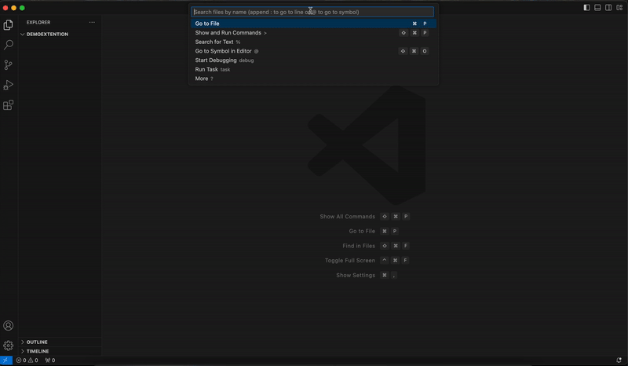

# **Node-initdb**  

**Node-initdb** is a Visual Studio Code extension designed to simplify the process of initializing database configurations and structures in Node.js projects. With support for Mongoose and Sequelize, JavaScript and TypeScript, [ Express, Fastify and Elysia ], [ Npm, Bun, Yarn and Pnpm ], this extension streamlines the setup of database connections and modules, saving developers valuable time.

---

## **Features**

### 1. **Setup Project**
Easily set up your Node.js project with essential configurations and a database connection.  
- Prompt-based project initialization.  
- Supports both **Mongoose** (MongoDB) and **Sequelize** (SQL databases).  
- Supports both **JavaScript** and **TypeScript** Programming Languages.  
- Supports **Express**, **Fastify** and **Elysia** Web Frameworks.  
- Supports **Npm**, **Bun**, **Yarn** and **Pnpm** Package Manager.  
- Automatically generates the required files and configurations.

### 2. **Add Module**
Quickly add new modules to your project with just a few inputs.  
- Supports Mongoose and Sequelize models.  
- Supports both JavaScript and TypeScript Programming Languages.  
- Supports Express, Fastify and Elysia Web Frameworks.   
- Automatically creates routes and registers them.  
- Copies the route registration snippet to your clipboard for quick integration.

---

## **Installation**
1. Open **Visual Studio Code**.  
2. Go to the **Extensions View** (`Ctrl+Shift+X` or `Cmd+Shift+X` on macOS).  
3. Search for `Node-initdb`.  
4. Click **Install**.

---

## **Usage**

### **1. Setting Up the Project**
1. Open a workspace in VS Code.  
2. Open the Command Palette (`Ctrl+Shift+P` or `Cmd+Shift+P` on macOS).  
3. Type `Node-initdb : Setup Project` and select the command.  
4. Follow the prompts to enter details such as package name, version, description, Database type, Language type, Web Framework type and PackageManager type (Mongoose or Sequelize, TS or JS, Express or Fastify or Elysia, Npm or Bun or Yarn or Pnpm).  
5. The extension will initialize the project and create necessary configurations.

### **2. Adding a Module**
1. Open the Command Palette (`Ctrl+Shift+P` or `Cmd+Shift+P` on macOS).  
2. Type `Node-initdb : Add Module` and select the command.  
3. Enter the module name when prompted.  
4. Choose the database type (Mongoose or Sequelize).  
5. Choose the language type (JavaScript or TypeScript).  
6. Choose the web framework type (Express or Fastify or Elysia).  
7. The extension generates the module files and copies the route registration snippet to your clipboard.

---

## **Commands**
| Command                        | Description                                          |  
|--------------------------------|------------------------------------------------------|  
| `Node-initdb : Setup Project`  | Sets up the project with database configuration.     |  
| `Node-initdb : Add Module`     | Adds a new module and generates route files.         |  

---

## **Key Features**

### **Database Support**  
- **Mongoose** for MongoDB.  
- **Sequelize** for SQL databases (MySQL, PostgreSQL, etc.).  

### **Language Support**  
- **TypeScript**  
- **JavaScript**  

### **Web Framework Support**  
- **Express**  
- **Fastify**  
- **Elysia**  

### **Package Manager Support**  
- **Npm**  
- **Bun**  
- **Yarn**  
- **Pnpm**  

### **Route Registration**  
- Automatically registers routes for added modules.  
- Provides a ready-to-use route snippet for quick integration.

### **Customizable Prompts**  
- Default values for commonly used configurations.  
- Skip fields to use defaults.

---

## **Contributing**
Contributions are welcome!  
1. Fork the repository: [GitHub Repository](https://github.com/MohamedAshraf701/Node-initdb-vs-code).  
2. Create a feature branch: `git checkout -b feature-name`.  
3. Commit changes: `git commit -m "Add feature"`.  
4. Push to the branch: `git push origin feature-name`.  
5. Submit a pull request.

---

## **Issues**
If you encounter any issues, please report them [here](https://github.com/MohamedAshraf701/Node-initdb-vs-code/issues).

---

## **License**
This extension is licensed under the [MIT License](LICENSE).  

---

## **Author**
**Mohamed Ashraf**  
- GitHub: [MohamedAshraf701](https://github.com/MohamedAshraf701)  
- Portfolio: [ashraf.digital](https://ashraf.digital)

